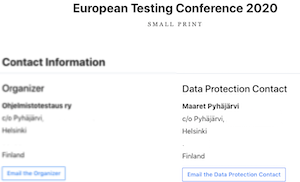

# History

**note:** It's with great trepidation that I post this. However, enough people have gotten the wrong idea that I need a place to offer a complete history. It is my hope that this will help to deescalate things 

## The start
Back in October of 2015, on a train ride back from the 'Tampere Goes Agile' conference. Maaret & I were talking about her attempts at Mob Programming at her work. I had been facilitating Mob Programming from before it had a name (I took the coding dojo technique from Laurent Bossavit & added [Strong Style Pair Programing](http://llewellynfalco.blogspot.com/2014/06/llewellyns-strong-style-pairing.html) back in 2009. Woody & I had been using it for hands on practice and training, but it wasn't until 2012 that Woody discovered it was useful as a production method). Often Maaret would describe a problem she had when she tried it and I would expand on something I had neglected to say or had assumed was obvious. It occurred to us that we should write this up and share it. [Allan Kelly](https://leanpub.com/u/allankelly) was also speaking at the conference and had talked about his experience writing a book on leanpub, so we decided to write it there. Maaret already had an account so we used it. We never expected it to make much money but agreed to split 50/50 (note: this actually took a bit because we didn't understand leanpub properly and accidently assign 100% of the royalties to me, later we were able to correct that). and that was the start of the [Mob Programming Guidebook](http://mobprogrammingguidebook.com)

### Github History
All of this is recorded on [github](https://github.com/isidore/MobProgrammingBook/commits/master?after=15d8c57382c6068a97fcd67b71e0baec5e9ea7eb+104). You can see my fork here, but there is a strangeness. You will notice that while some of the commit say Maaret, if you click the link it will go to the account of [yakik](https://github.com/yakik). I can only assume Maaret changed her account in an attempt to control her history, but this is speculation.

## Authorship and Names

Originally we decided to have [my name first](https://github.com/isidore/MobProgrammingBook/blob/d7cdd078e4e86779bd4e5e1d6ad5d4492a7a6beb/manuscript/images/title_page.png).   

The idea was that leanpub forced her name to be first because we used her account and this would balance that out. It was a book we were writing together, and the order didn't matter. I would often solicit advice from friends and family and one thing my dad said was that it was confusing to have the authors in different order in different places. So I changed the order as I never felt mattered in the first place.

As for authorship, as Maaret herself as said, ["we strong style paired every line of this book."](https://github.com/isidore/MobProgrammingBook/commit/d5bdb05b7caa91ac3c0d0783a2b22c55dbf8c20b). As she has also said, ["physically, I (Maaret) had written"](https://visible-quality.blogspot.com/2019/10/a-man-in-tech-doxed-me-for-copyright.html)
If you are unfamiliar with this style of pairing, it's easy to assume this means we talked about the stuff in the book and then she would go back an write the book. But this is not how strong style work. The rule is

" For an idea to go from your head into the computer 
   it MUST go through someone else's hands" - 
 [Llewellyn's Strong Style Pairing](http://llewellynfalco.blogspot.com/2014/06/llewellyns-strong-style-pairing.html)

or, as the book itself says

"The driver is the typist. There should be “no thinking” done by the driver." - [Mob Programming Guidebook, page 14](http://www.mobprogrammingguidebook.com/images/mobprogrammingguidebook.pdf)

And indeed, for almost every line of this book, Maaret was the driver and I was the navigator. You might be wondering if I believe that is solely my book, as she was 'just typing'. **I do NOT**. I believe that you have very different conversations and richer interactions when you pair. Being the driver does not mean you are not contributing. This is something we wrote together, which is why when I filed for an official copyright I did it with both of our names. 

## Maaret decides to take the book

**Warning, this gets very personal**  
 
### History with Maaret

Maaret and I dated from late 2014 until July 18, 2018.   

 We lived together for much of that time. I moved into my own place in Finland in spring 2018 but we continued to date. Maaret has two wonderful kids that I love very much, so I got a place across the street from her so I could continue to be part of their lives. At the time she was very supportive of this.

When we initially separated, Maaret was still supportive of the me being part of the kid’s life. Even when she was angry at me and wanted to hurt me by doing the same thing, she knew was effective at hurting me.  

It wasn't until I met someone new that all that changed. I actually meet someone completely new a very short time afterwards (August 4th) on the other side of the world. When I met my current girlfriend Maaret stopped me the kids from being allowed at my place and from me seeing them. I thought this might just be a short angry burst, but after a few months not only had it not passed, but she was telling the kids that "I was free to see them", but me "That I wasn't allowed to". This creates a bad dynamic where they feel I'm not seeing them 'on purpose'. Eventually I gave up and moved back to America.

### Maaret steals the book

On  Aug 19,2018 Maaret decided to remove me as author form the book.   

She also changed the cover to black (still using the photo I took).

You might ask why I didn't fight back immediately. The short answer was the kids. They were the ultimate lever that Maaret had all the control over. At the time it would still be 3 months before I had lost all hope in seeing them again, so I knew that even if I won this battle, it would mean me losing the war. 

## I decide to fight back

Between October 2018 - April 2019, not much happened with the book.  

For a while, I just decided to give up on this. It wasn't until 
I saw this [tweet from Amitai Schleier](https://twitter.com/schmonz/status/1113126360774578176)

Amitai is a friend and was one of my visiting coaches. It hurt to see him removing my name from my work. I understand why he did it. No one wants to be in the middle of this mess. But this is when I decided to get a copywrite lawyer. I also submitted a claim to leanpub. They agreed and removed the book. An hour later Maaret just created a new book: mobprogramming-guidebook.
I resubmitted a claim.  

Leanpub agreed that this naming change was not in the spirt, and as far as I am aware, Maaret has not submitted another time on leanpub. She has on GitHub.

I also took the last version of the book we wrote together and [published it for free via github](https://github.com/isidore/MobProgrammingBook)

Maaret immediately submitted a claim to GitHub, stating that I did not have rights to the book we created (the book I & Maaret both have official copywrite on). I was glad that I had started the copywrite submittal process.

## Doxxing 

I did not dox Maaret. I did not publish her information. I did not promote, and DO NOT promote, the harassing of her or anyone. I have already gone thru enough harassment from the people Maaret has sent to me to not wish this on anyone.

My lawyer did honestly and accurately submit the information required by law to the copywrite office. Apparently, that information is published by the copywrite office. I was informed of that when Maaret wrote me to say I had doxed her. I did a quick internet search, and this is common. Her address is also published for this year for the EuropeanTestingConference (another thing I helped create with her that she took). 

 

This is personal opinion, but as she self-published her address online, I don't think she is upset about that. I think she is upset that we have to share the copywrite of the book we wrote together.

## Harassment on my side

I have had a lot of harassment from Maaret. She has posted on twitter to conferences I've been at asking attendees to come and talk to me until I change my mind. She has written about me on her blog. She threatened to sue my Mother and Sister because their company hosts my person email. And recently she has publicly advocated to have conference reject me and made everyone who was friends with both of us [choose a side](https://twitter.com/maaretp/status/1188031928160718848) 

I do not believe in splitting up friends after a break up. If you are friends with Maaret that is fine. If you are friends with me that is also fine. Maaret was a wonderful person while we were dating, and I have no reason to believe she has changed in respect to others, who are not me, since then.

If you are still upset, I encourage you to reach out and have a call with me, or talk to me in person. I have a long list at the moment, so scheduling might take a bit of time, but I believe in open communication and would be happy to talk.

